# Diagramas de Fluxo - Sistema de Almoxarifado

Este documento contém diagramas visuais dos principais fluxos do sistema usando Mermaid.

---

## 1. Fluxo de Requisição e Aprovação

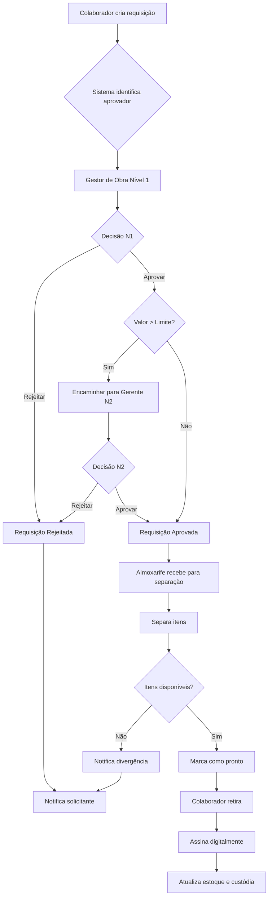

---

## 2. Arquitetura de Dados Simplificada

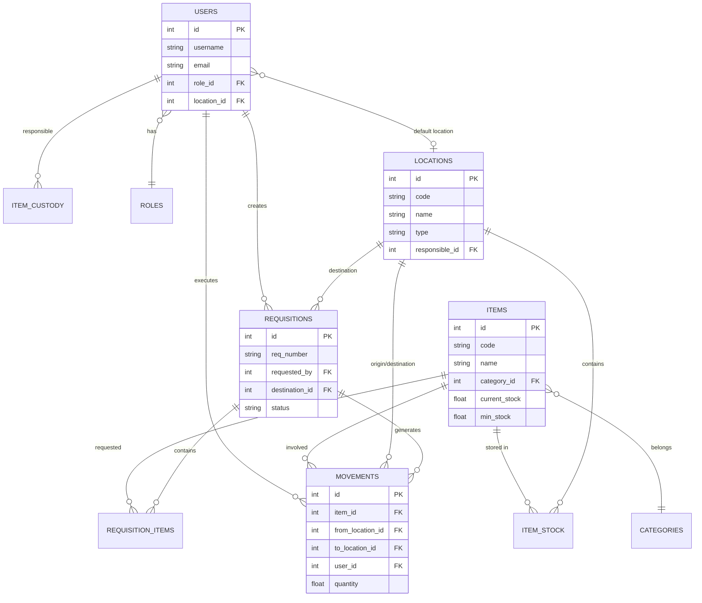

---

## 3. Fluxo de Devolução

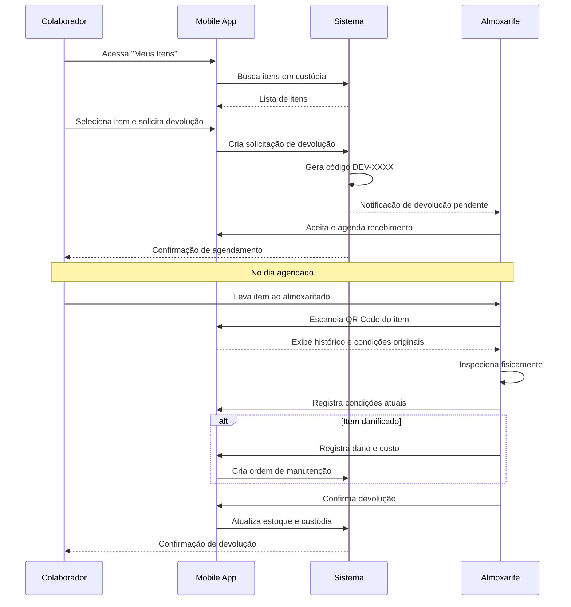

---

## 4. Estados de uma Requisição

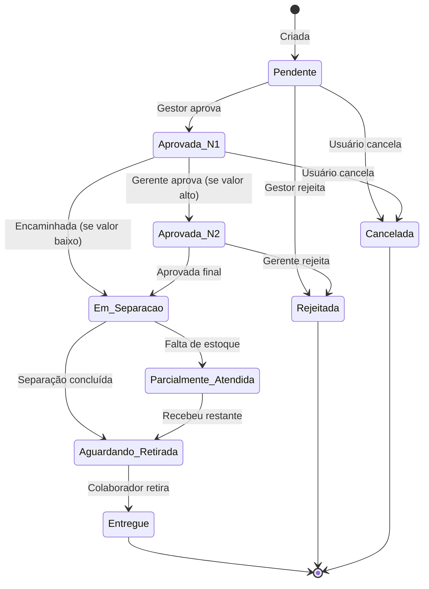

---

## 5. Arquitetura do Sistema

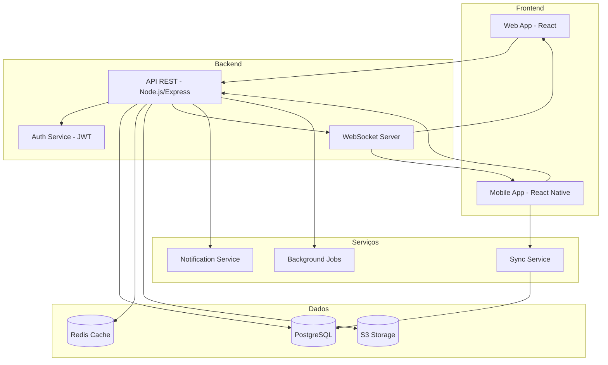

---

## 6. Fluxo de Inventário Cíclico

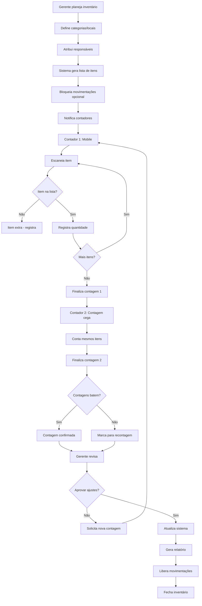

---

## 7. Estrutura de Permissões (RBAC)

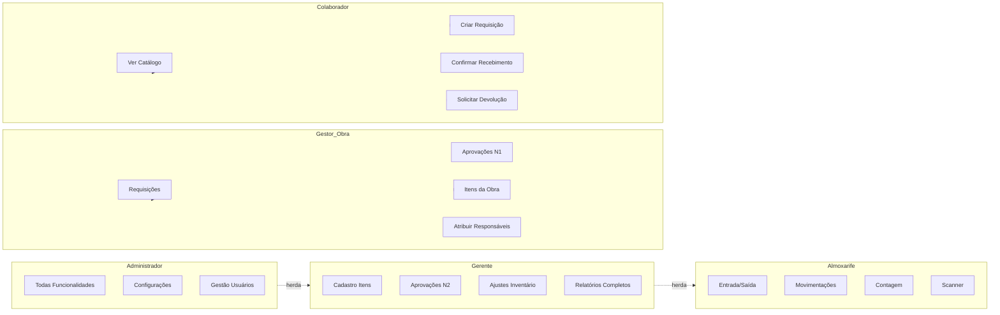

---

## 8. Fluxo de Sincronização Offline

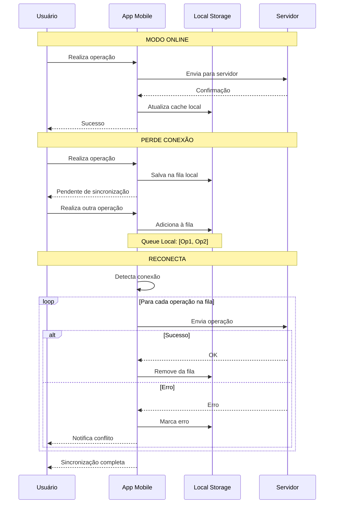

---

## 9. Jornada do Usuário - Colaborador

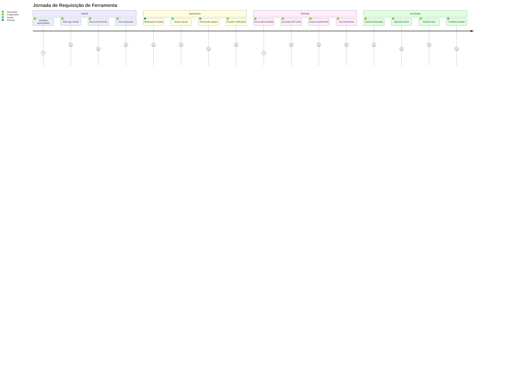

---

## 10. Ciclo de Vida de um Item

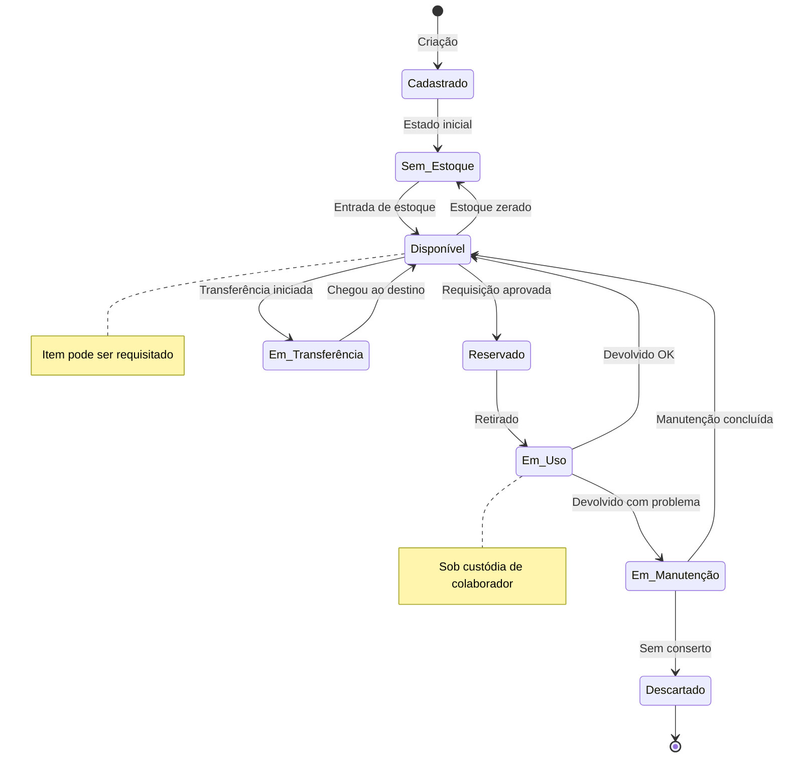

---

## 11. Dashboard - Visão por Perfil

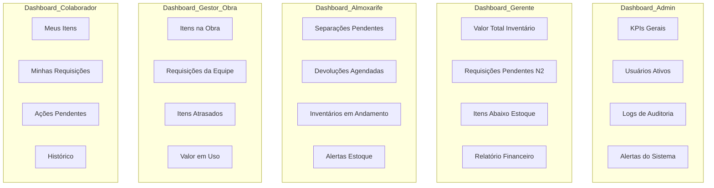

---

## 12. Fluxo de Transferência Entre Obras

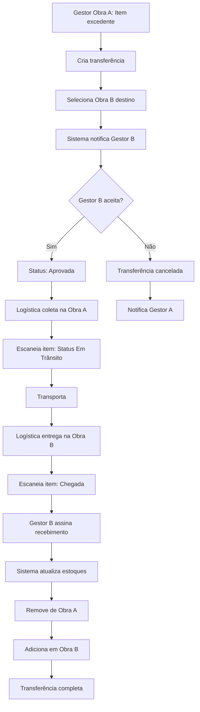

---

## 13. Tipos de Notificações

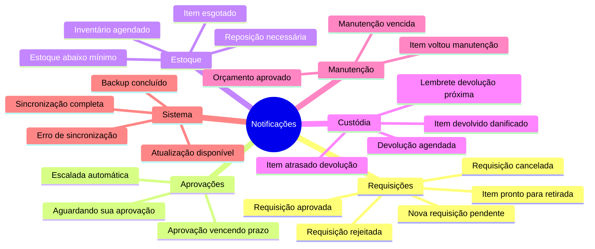

---

## 14. Fluxo de Onboarding de Novo Usuário

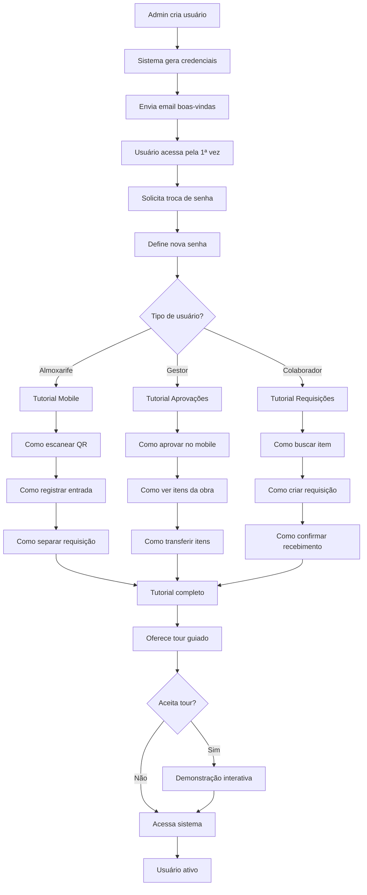

---

## 15. Integração com Sistema ERP (Futuro)

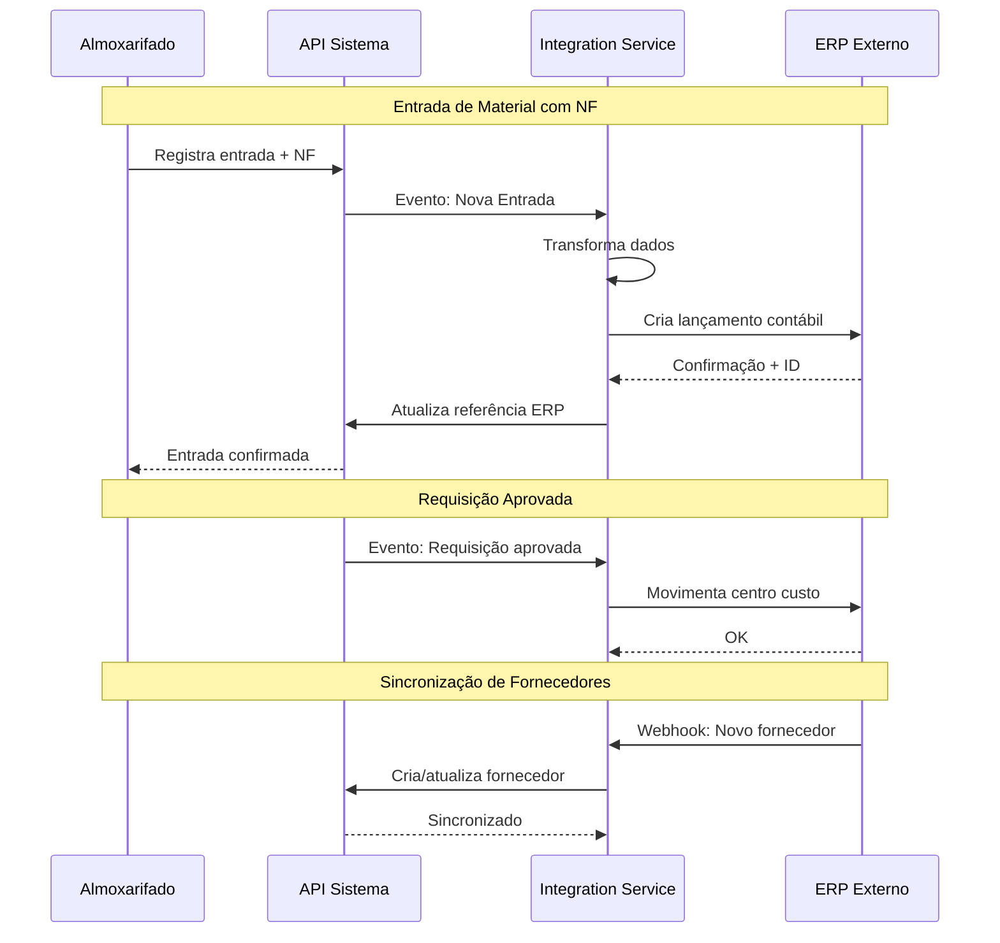

---

## Legenda

- **Retângulos:** Processos/Ações
- **Losangos:** Decisões
- **Cilindros:** Bancos de dados
- **Nuvens:** Serviços externos
- **Setas sólidas:** Fluxo principal
- **Setas tracejadas:** Fluxo alternativo/notificações

---

## Como Visualizar

Estes diagramas estão em formato **Mermaid** e podem ser visualizados em:

1. **GitHub/GitLab:** Renderizam automaticamente em arquivos .md
2. **VSCode:** Extensão "Markdown Preview Mermaid Support"
3. **Online:** https://mermaid.live/
4. **Notion, Confluence:** Suporte nativo
5. **Documentação:** Docusaurus, MkDocs, etc.

---

**Documento criado em:** 2025-11-11
**Versão:** 1.0

*Para entender os fluxos em detalhes textuais, consultar REQUISITOS_SISTEMA_ALMOXARIFADO.md*
