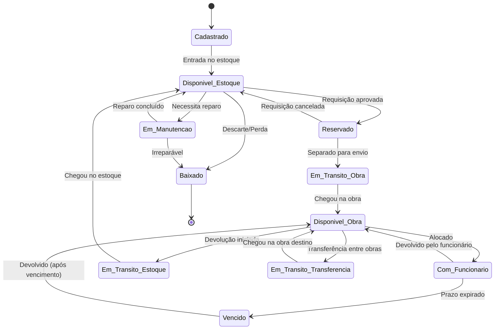

# Estados e Ciclo de Vida dos Itens

## 🎯 Visão Geral

Este documento define **todos os estados possíveis** que um item pode ter no sistema, as **transições permitidas** entre estados, e as **regras de negócio** que governam cada mudança de estado.

---

## 📊 Máquina de Estados - Visão Geral



---

## 📋 Estados Detalhados

### 1. CADASTRADO

**Descrição**: Item recém criado no sistema, ainda não disponível para uso.

**Características:**
- Apenas informações básicas cadastradas
- Sem quantidade definida
- Não aparece em buscas de disponibilidade
- Aguarda entrada física no estoque

**Campos Obrigatórios:**
- Nome
- Código único
- Categoria
- Unidade de medida

**Transições Permitidas:**
- → `Disponivel_Estoque`: Após entrada física no almoxarifado

**Exemplo:**
```json
{
  "id": "item-001",
  "nome": "Furadeira Bosch GSB 13 RE",
  "codigo": "FER-001",
  "status": "cadastrado",
  "quantidade_total": 0,
  "created_at": "2025-11-10T14:30:00Z"
}
```

---

### 2. DISPONÍVEL NO ESTOQUE

**Descrição**: Item fisicamente presente no almoxarifado e disponível para requisição.

**Características:**
- Localizado em setor/prateleira específica
- Quantidade contabilizada
- Aparece em buscas
- Pode ser requisitado

**Campos Adicionais:**
- Setor / Prateleira
- Quantidade disponível
- Estoque mínimo
- Estoque máximo

**Transições Permitidas:**
- → `Reservado`: Quando requisitado e aprovado
- → `Em_Manutencao`: Se necessitar reparo
- → `Baixado`: Em caso de descarte, perda ou roubo

**Regras de Negócio:**
- ✅ Pode ser requisitado (se qtd > 0)
- ✅ Quantidade pode ser ajustada (inventário)
- ❌ Não pode sair do estoque sem aprovação

**Exemplo:**
```json
{
  "id": "item-001",
  "status": "disponivel_estoque",
  "localizacao": {
    "tipo": "estoque",
    "estoque_id": "almox-principal",
    "setor": "Ferramentas Elétricas - A",
    "prateleira": "A3",
    "quantidade": 10
  },
  "estoque_minimo": 5,
  "estoque_maximo": 20,
  "updated_at": "2025-11-10T15:00:00Z"
}
```

---

### 3. RESERVADO

**Descrição**: Item aprovado para saída mas ainda não foi fisicamente separado/enviado.

**Características:**
- Quantidade reservada (não disponível para outras requisições)
- Aguardando separação pelo almoxarife
- Temporário (max 24h)

**Campos Adicionais:**
- Requisição ID
- Obra destino
- Solicitante
- Data/hora da reserva
- Prazo de separação

**Transições Permitidas:**
- → `Em_Transito_Obra`: Quando separado e enviado
- → `Disponivel_Estoque`: Se requisição for cancelada

**Regras de Negócio:**
- ✅ Quantidade reservada deduzida do "disponível"
- ✅ Reserva expira em 24h se não separado
- ⏱️ Notificar almoxarife para separar

**Exemplo:**
```json
{
  "id": "item-001",
  "status": "reservado",
  "quantidade_reservada": 5,
  "reserva": {
    "requisicao_id": "req-1234",
    "obra_destino_id": "obra-001",
    "solicitante_id": "user-123",
    "reservado_em": "2025-11-10T16:00:00Z",
    "expira_em": "2025-11-11T16:00:00Z"
  }
}
```

---

### 4. EM TRÂNSITO PARA OBRA

**Descrição**: Item foi separado do estoque e está sendo transportado para a obra.

**Características:**
- Saiu fisicamente do almoxarifado
- Em transporte
- Rastreável

**Campos Adicionais:**
- Origem (estoque)
- Destino (obra)
- Responsável pelo transporte
- Data/hora de saída
- Previsão de chegada
- Nota de saída

**Transições Permitidas:**
- → `Disponivel_Obra`: Quando chegar e ser confirmado na obra

**Regras de Negócio:**
- ✅ Requer confirmação de saída (almoxarife)
- ✅ Requer confirmação de chegada (encarregado obra)
- ⏱️ Alertar se não chegar em 48h
- 📍 Rastreamento via motorista/transportador

**Exemplo:**
```json
{
  "id": "item-001",
  "status": "em_transito_obra",
  "transito": {
    "origem": {
      "tipo": "estoque",
      "id": "almox-principal"
    },
    "destino": {
      "tipo": "obra",
      "id": "obra-001",
      "nome": "Edifício Central"
    },
    "responsavel_transporte": "motorista-001",
    "saida_em": "2025-11-10T17:00:00Z",
    "previsao_chegada": "2025-11-10T18:00:00Z",
    "nota_saida": "NS-001234",
    "quantidade": 5
  }
}
```

---

### 5. DISPONÍVEL NA OBRA

**Descrição**: Item presente fisicamente na obra e disponível para uso geral.

**Características:**
- Localizado em canteiro/obra específica
- Disponível para alocação a funcionários
- Sob responsabilidade do encarregado da obra

**Campos Adicionais:**
- Obra ID
- Responsável (encarregado)
- Quantidade disponível
- Local de armazenamento na obra

**Transições Permitidas:**
- → `Com_Funcionario`: Quando alocado a um funcionário específico
- → `Em_Transito_Estoque`: Quando devolvido ao almoxarifado
- → `Em_Transito_Transferencia`: Quando transferido para outra obra
- → `Em_Manutencao`: Se necessitar reparo

**Regras de Negócio:**
- ✅ Pode ser alocado para funcionários
- ✅ Encarregado é responsável
- ✅ Pode ser transferido entre obras
- ⏱️ Inventário periódico obrigatório

**Exemplo:**
```json
{
  "id": "item-001",
  "status": "disponivel_obra",
  "localizacao": {
    "tipo": "obra",
    "obra_id": "obra-001",
    "obra_nome": "Edifício Central",
    "responsavel_id": "enc-001",
    "responsavel_nome": "Maria Santos",
    "local_armazenamento": "Container 2 - Ferramentas",
    "quantidade": 5,
    "chegou_em": "2025-11-10T18:00:00Z"
  }
}
```

---

### 6. COM FUNCIONÁRIO

**Descrição**: Item sob custódia individual de um funcionário específico.

**Características:**
- Alocado nominalmente
- Prazo de devolução definido
- Termo de responsabilidade assinado
- Rastreável individualmente

**Campos Adicionais:**
- Funcionário ID
- Obra onde está sendo usado
- Data de alocação
- Prazo de devolução
- Termo de responsabilidade
- Observações
- Fotos (opcional)

**Transições Permitidas:**
- → `Disponivel_Obra`: Quando devolvido normalmente
- → `Vencido`: Se prazo expirar sem devolução
- → `Em_Manutencao`: Se danificado e necessitar reparo
- → `Baixado`: Se perdido/roubado/destruído

**Regras de Negócio:**
- ✅ Termo de responsabilidade obrigatório
- ✅ Prazo de devolução obrigatório
- ⏱️ Notificar funcionário 2 dias antes do vencimento
- ⏱️ Notificar encarregado no dia do vencimento
- ⏱️ Alertar gestão se vencido > 7 dias

**Exemplo:**
```json
{
  "id": "item-001",
  "status": "com_funcionario",
  "custodia": {
    "funcionario_id": "func-123",
    "funcionario_nome": "João Silva",
    "funcionario_funcao": "Eletricista",
    "obra_id": "obra-001",
    "obra_nome": "Edifício Central",
    "quantidade": 2,
    "alocado_em": "2025-11-09T08:00:00Z",
    "prazo_devolucao": "2025-11-15T18:00:00Z",
    "termo_responsabilidade": {
      "assinatura_digital": "data:image/png;base64...",
      "assinado_em": "2025-11-09T08:05:00Z",
      "testemunha_id": "enc-001",
      "testemunha_nome": "Maria Santos"
    },
    "observacoes": "Instalação elétrica 2º andar",
    "fotos": [
      "https://storage.app.com/itens/foto1.jpg"
    ]
  }
}
```

---

### 7. VENCIDO

**Descrição**: Item com funcionário que não foi devolvido no prazo.

**Características:**
- Prazo de devolução expirado
- Funcionário em débito
- Requer atenção urgente
- Bloqueios automáticos

**Campos Adicionais:**
- Dias de atraso
- Tentativas de contato
- Ações tomadas

**Transições Permitidas:**
- → `Disponivel_Obra`: Quando finalmente devolvido
- → `Baixado`: Se irrecuperável (perda confirmada)

**Regras de Negócio:**
- 🔴 Bloquear novas alocações para o funcionário
- 🔴 Notificação diária para funcionário
- 🔴 Notificação semanal para gestor
- 🔴 Após 30 dias, iniciar processo de desconto em folha
- ✅ Permite extensão de prazo (com aprovação)

**Exemplo:**
```json
{
  "id": "item-001",
  "status": "vencido",
  "vencimento": {
    "funcionario_id": "func-123",
    "funcionario_nome": "João Silva",
    "prazo_original": "2025-11-08T18:00:00Z",
    "dias_atraso": 5,
    "tentativas_contato": [
      {
        "tipo": "notificacao_app",
        "enviado_em": "2025-11-08T19:00:00Z"
      },
      {
        "tipo": "whatsapp",
        "enviado_em": "2025-11-09T09:00:00Z"
      },
      {
        "tipo": "telefone",
        "enviado_em": "2025-11-10T14:00:00Z",
        "atendeu": false
      }
    ],
    "acoes_tomadas": [
      "Bloqueio de novas alocações",
      "Notificação ao encarregado",
      "Email para gestor da obra"
    ]
  }
}
```

---

### 8. EM TRÂNSITO PARA ESTOQUE (Devolução)

**Descrição**: Item sendo devolvido da obra para o almoxarifado.

**Características:**
- Saiu da obra
- Retornando ao estoque
- Em transporte

**Campos Adicionais:**
- Origem (obra)
- Destino (estoque)
- Motivo da devolução
- Estado do item
- Responsável pelo transporte

**Transições Permitidas:**
- → `Disponivel_Estoque`: Quando chegar e ser confirmado no almoxarifado
- → `Em_Manutencao`: Se chegar danificado

**Regras de Negócio:**
- ✅ Requer confirmação de saída (encarregado)
- ✅ Requer inspeção na chegada (almoxarife)
- ✅ Pode indicar necessidade de manutenção

**Exemplo:**
```json
{
  "id": "item-001",
  "status": "em_transito_estoque",
  "devolucao": {
    "origem": {
      "tipo": "obra",
      "id": "obra-001"
    },
    "destino": {
      "tipo": "estoque",
      "id": "almox-principal"
    },
    "motivo": "Trabalho concluído",
    "estado": "bom",
    "observacoes": "Item em perfeitas condições",
    "responsavel_transporte": "motorista-001",
    "saida_em": "2025-11-15T16:00:00Z",
    "quantidade": 5
  }
}
```

---

### 9. EM TRÂNSITO - TRANSFERÊNCIA

**Descrição**: Item sendo transferido entre duas obras.

**Características:**
- Saiu de uma obra
- Indo para outra obra
- Não passa pelo estoque

**Campos Adicionais:**
- Obra origem
- Obra destino
- Solicitante
- Aprovador
- Responsável transporte

**Transições Permitidas:**
- → `Disponivel_Obra`: Quando chegar na obra destino

**Regras de Negócio:**
- ✅ Requer aprovação do encarregado da obra origem
- ✅ Requer confirmação de saída
- ✅ Requer confirmação de chegada
- ⏱️ Prazo máximo de 72h

**Exemplo:**
```json
{
  "id": "item-001",
  "status": "em_transito_transferencia",
  "transferencia": {
    "origem": {
      "tipo": "obra",
      "id": "obra-001",
      "nome": "Edifício Central"
    },
    "destino": {
      "tipo": "obra",
      "id": "obra-002",
      "nome": "Shopping Norte"
    },
    "solicitante_id": "enc-002",
    "aprovador_id": "enc-001",
    "aprovado_em": "2025-11-11T10:00:00Z",
    "responsavel_transporte": "motorista-001",
    "saida_em": "2025-11-11T14:00:00Z",
    "previsao_chegada": "2025-11-11T16:00:00Z",
    "quantidade": 3
  }
}
```

---

### 10. EM MANUTENÇÃO

**Descrição**: Item necessita ou está em processo de reparo/manutenção.

**Características:**
- Indisponível para uso
- Em reparo
- Custo adicional

**Campos Adicionais:**
- Tipo de manutenção
- Descrição do problema
- Fornecedor/técnico
- Data de entrada
- Previsão de conclusão
- Custo estimado
- Fotos do dano

**Transições Permitidas:**
- → `Disponivel_Estoque`: Quando reparo concluído
- → `Baixado`: Se irreparável ou custo inviável

**Regras de Negócio:**
- ✅ Requer orçamento (se custo > R$ 100)
- ✅ Requer aprovação (se custo > R$ 500)
- ⏱️ Alertar se manutenção > 15 dias
- 📊 Histórico de manutenções registrado

**Exemplo:**
```json
{
  "id": "item-001",
  "status": "em_manutencao",
  "manutencao": {
    "tipo": "corretiva",
    "problema": "Motor queimado",
    "entrada_em": "2025-11-12T09:00:00Z",
    "previsao_conclusao": "2025-11-20T18:00:00Z",
    "fornecedor": "Assistência Técnica Bosch",
    "orcamento": {
      "pecas": 250.00,
      "mao_obra": 150.00,
      "total": 400.00,
      "aprovado": true,
      "aprovador_id": "gestor-001"
    },
    "fotos_dano": [
      "https://storage.app.com/manutencao/foto1.jpg"
    ],
    "historico": [
      {
        "data": "2024-05-10",
        "tipo": "preventiva",
        "custo": 80.00
      }
    ]
  }
}
```

---

### 11. BAIXADO

**Descrição**: Item removido permanentemente do inventário ativo.

**Características:**
- Não mais disponível
- Fora de circulação
- Motivo registrado

**Campos Adicionais:**
- Motivo da baixa
- Data da baixa
- Responsável
- Valor residual
- Documentação

**Transições Permitidas:**
- Nenhuma (estado final)

**Regras de Negócio:**
- ✅ Requer justificativa obrigatória
- ✅ Requer aprovação (gestor)
- ✅ Requer documentação (BO se roubo, laudo se dano)
- 📊 Mantém no histórico para auditoria
- 💰 Pode gerar desconto em folha (se perda por responsabilidade)

**Exemplo:**
```json
{
  "id": "item-001",
  "status": "baixado",
  "baixa": {
    "motivo": "roubo",
    "data": "2025-11-13T10:00:00Z",
    "responsavel_baixa_id": "gestor-001",
    "valor_residual": 0,
    "documentacao": {
      "tipo": "boletim_ocorrencia",
      "numero": "BO-123456/2025",
      "arquivo": "https://storage.app.com/docs/bo123456.pdf"
    },
    "observacoes": "Item foi roubado da obra durante a madrugada. BO registrado.",
    "ultima_localizacao": {
      "tipo": "obra",
      "id": "obra-001",
      "responsavel": "enc-001"
    },
    "impacto_financeiro": {
      "valor_item": 450.00,
      "seguro_cobre": false,
      "responsabilizacao": null
    }
  }
}
```

**Motivos de Baixa Comuns:**
- `desgaste_natural`: Fim da vida útil
- `obsolescencia`: Tecnologia ultrapassada
- `roubo`: Furto ou roubo
- `perda`: Extraviado
- `dano_irreparavel`: Dano além do reparo
- `doacao`: Doado a terceiros
- `venda`: Vendido

---

## 🔄 Matriz de Transições

| De \ Para | Disponível Estoque | Reservado | Em Trânsito Obra | Disponível Obra | Com Funcionário | Vencido | Em Trânsito Estoque | Em Trânsito Transferência | Em Manutenção | Baixado |
|-----------|-------------------|-----------|------------------|-----------------|-----------------|---------|---------------------|---------------------------|---------------|---------|
| **Cadastrado** | ✅ | ❌ | ❌ | ❌ | ❌ | ❌ | ❌ | ❌ | ❌ | ❌ |
| **Disponível Estoque** | - | ✅ | ❌ | ❌ | ❌ | ❌ | ❌ | ❌ | ✅ | ✅ |
| **Reservado** | ✅ | - | ✅ | ❌ | ❌ | ❌ | ❌ | ❌ | ❌ | ❌ |
| **Em Trânsito Obra** | ❌ | ❌ | - | ✅ | ❌ | ❌ | ❌ | ❌ | ❌ | ❌ |
| **Disponível Obra** | ❌ | ❌ | ❌ | - | ✅ | ❌ | ✅ | ✅ | ✅ | ❌ |
| **Com Funcionário** | ❌ | ❌ | ❌ | ✅ | - | ✅ | ❌ | ❌ | ✅ | ✅ |
| **Vencido** | ❌ | ❌ | ❌ | ✅ | ❌ | - | ❌ | ❌ | ❌ | ✅ |
| **Em Trânsito Estoque** | ✅ | ❌ | ❌ | ❌ | ❌ | ❌ | - | ❌ | ✅ | ❌ |
| **Em Trânsito Transferência** | ❌ | ❌ | ❌ | ✅ | ❌ | ❌ | ❌ | - | ❌ | ❌ |
| **Em Manutenção** | ✅ | ❌ | ❌ | ❌ | ❌ | ❌ | ❌ | ❌ | - | ✅ |
| **Baixado** | ❌ | ❌ | ❌ | ❌ | ❌ | ❌ | ❌ | ❌ | ❌ | - |

✅ = Transição permitida
❌ = Transição não permitida

---

## ⚙️ Implementação Técnica

### Enum de Estados

```typescript
enum ItemStatus {
  CADASTRADO = 'cadastrado',
  DISPONIVEL_ESTOQUE = 'disponivel_estoque',
  RESERVADO = 'reservado',
  EM_TRANSITO_OBRA = 'em_transito_obra',
  DISPONIVEL_OBRA = 'disponivel_obra',
  COM_FUNCIONARIO = 'com_funcionario',
  VENCIDO = 'vencido',
  EM_TRANSITO_ESTOQUE = 'em_transito_estoque',
  EM_TRANSITO_TRANSFERENCIA = 'em_transito_transferencia',
  EM_MANUTENCAO = 'em_manutencao',
  BAIXADO = 'baixado'
}
```

### Validação de Transições

```typescript
class ItemStateMachine {
  private static transitions: Map<ItemStatus, ItemStatus[]> = new Map([
    [ItemStatus.CADASTRADO, [ItemStatus.DISPONIVEL_ESTOQUE]],
    [ItemStatus.DISPONIVEL_ESTOQUE, [
      ItemStatus.RESERVADO,
      ItemStatus.EM_MANUTENCAO,
      ItemStatus.BAIXADO
    ]],
    [ItemStatus.RESERVADO, [
      ItemStatus.DISPONIVEL_ESTOQUE,
      ItemStatus.EM_TRANSITO_OBRA
    ]],
    [ItemStatus.EM_TRANSITO_OBRA, [ItemStatus.DISPONIVEL_OBRA]],
    [ItemStatus.DISPONIVEL_OBRA, [
      ItemStatus.COM_FUNCIONARIO,
      ItemStatus.EM_TRANSITO_ESTOQUE,
      ItemStatus.EM_TRANSITO_TRANSFERENCIA,
      ItemStatus.EM_MANUTENCAO
    ]],
    [ItemStatus.COM_FUNCIONARIO, [
      ItemStatus.DISPONIVEL_OBRA,
      ItemStatus.VENCIDO,
      ItemStatus.EM_MANUTENCAO,
      ItemStatus.BAIXADO
    ]],
    [ItemStatus.VENCIDO, [
      ItemStatus.DISPONIVEL_OBRA,
      ItemStatus.BAIXADO
    ]],
    [ItemStatus.EM_TRANSITO_ESTOQUE, [
      ItemStatus.DISPONIVEL_ESTOQUE,
      ItemStatus.EM_MANUTENCAO
    ]],
    [ItemStatus.EM_TRANSITO_TRANSFERENCIA, [ItemStatus.DISPONIVEL_OBRA]],
    [ItemStatus.EM_MANUTENCAO, [
      ItemStatus.DISPONIVEL_ESTOQUE,
      ItemStatus.BAIXADO
    ]],
    [ItemStatus.BAIXADO, []] // Estado final
  ]);

  static canTransition(from: ItemStatus, to: ItemStatus): boolean {
    const allowedTransitions = this.transitions.get(from) || [];
    return allowedTransitions.includes(to);
  }

  static validateTransition(from: ItemStatus, to: ItemStatus): void {
    if (!this.canTransition(from, to)) {
      throw new Error(
        `Transição inválida: ${from} → ${to}`
      );
    }
  }
}
```

### Histórico de Mudanças de Estado

```typescript
interface StatusHistoryEntry {
  from_status: ItemStatus;
  to_status: ItemStatus;
  changed_at: Date;
  changed_by: string;
  reason?: string;
  metadata?: Record<string, any>;
}

class ItemStatusHistory {
  async recordStatusChange(
    itemId: string,
    from: ItemStatus,
    to: ItemStatus,
    userId: string,
    reason?: string,
    metadata?: any
  ): Promise<void> {
    // Validar transição
    ItemStateMachine.validateTransition(from, to);

    // Registrar no histórico
    await db.insert('status_history', {
      item_id: itemId,
      from_status: from,
      to_status: to,
      changed_at: new Date(),
      changed_by: userId,
      reason,
      metadata: JSON.stringify(metadata)
    });

    // Atualizar status atual do item
    await db.update('items', { id: itemId }, {
      status: to,
      status_updated_at: new Date()
    });

    // Triggerar eventos/notificações
    await this.triggerStatusChangeEvents(itemId, from, to);
  }

  private async triggerStatusChangeEvents(
    itemId: string,
    from: ItemStatus,
    to: ItemStatus
  ): Promise<void> {
    // Exemplo: Notificar quando item vence
    if (to === ItemStatus.VENCIDO) {
      await notificationService.notifyOverdueItem(itemId);
    }

    // Exemplo: Atualizar estoque
    if (to === ItemStatus.DISPONIVEL_ESTOQUE) {
      await inventoryService.updateStock(itemId);
    }
  }
}
```

---

## 📊 Relatórios por Estado

### Consultas Úteis

```sql
-- Itens por estado
SELECT status, COUNT(*) as quantidade
FROM items
WHERE status != 'baixado'
GROUP BY status
ORDER BY quantidade DESC;

-- Itens vencidos (top 10 funcionários)
SELECT
  f.nome as funcionario,
  COUNT(*) as itens_vencidos,
  SUM(DATEDIFF(NOW(), il.prazo_devolucao)) as dias_totais_atraso
FROM item_locations il
JOIN funcionarios f ON il.funcionario_id = f.id
WHERE il.status = 'vencido'
GROUP BY f.id
ORDER BY itens_vencidos DESC
LIMIT 10;

-- Tempo médio em cada estado
SELECT
  sh.to_status,
  AVG(TIMESTAMPDIFF(HOUR, sh.changed_at,
      COALESCE(sh2.changed_at, NOW()))) as horas_medias
FROM status_history sh
LEFT JOIN status_history sh2
  ON sh.item_id = sh2.item_id
  AND sh2.changed_at > sh.changed_at
GROUP BY sh.to_status;

-- Itens em trânsito há mais de 48h (alerta)
SELECT
  i.nome,
  i.status,
  il.origem_obra,
  il.destino_obra,
  il.updated_at,
  TIMESTAMPDIFF(HOUR, il.updated_at, NOW()) as horas_em_transito
FROM items i
JOIN item_locations il ON i.id = il.item_id
WHERE i.status IN ('em_transito_obra', 'em_transito_transferencia')
  AND TIMESTAMPDIFF(HOUR, il.updated_at, NOW()) > 48;
```

---

## 🎯 Dashboards Recomendados

### Dashboard 1: Visão Geral

```
┌────────────────────────────────────────┐
│ DISTRIBUIÇÃO DE ITENS POR ESTADO      │
├────────────────────────────────────────┤
│                                        │
│ 📦 Disponível Estoque    3.450 (45%)  │
│ 🏗️ Disponível Obra       2.120 (28%)  │
│ 👷 Com Funcionário         980 (13%)  │
│ 🔄 Em Trânsito             150 (2%)   │
│ 🔧 Em Manutenção            85 (1%)   │
│ 📋 Reservado               180 (2%)   │
│ ⚠️ Vencido                  95 (1%)   │
│                                        │
│ TOTAL ATIVO:             7.060 itens  │
│ BAIXADO (histórico):       940 itens  │
└────────────────────────────────────────┘
```

### Dashboard 2: Alertas Críticos

```
┌────────────────────────────────────────┐
│ ITENS QUE REQUEREM ATENÇÃO            │
├────────────────────────────────────────┤
│                                        │
│ 🔴 95 itens VENCIDOS                  │
│    [Ver Detalhes] →                   │
│                                        │
│ 🟡 123 itens vencem em 48h            │
│    [Ver Detalhes] →                   │
│                                        │
│ 🟠 45 itens em trânsito > 48h         │
│    [Investigar] →                     │
│                                        │
│ 🔧 12 itens em manutenção > 15 dias   │
│    [Verificar Status] →               │
│                                        │
│ 📦 18 reservas vão expirar hoje       │
│    [Processar] →                      │
└────────────────────────────────────────┘
```

---

## ✅ Checklist de Implementação

### Fase 1: Básico
- [ ] Criar enum de estados
- [ ] Implementar validação de transições
- [ ] Criar tabela de histórico
- [ ] Testes unitários das transições

### Fase 2: Regras de Negócio
- [ ] Implementar regras por estado
- [ ] Validações de campos obrigatórios
- [ ] Notificações automáticas
- [ ] Cron jobs para expiração

### Fase 3: Monitoramento
- [ ] Dashboard de estados
- [ ] Alertas críticos
- [ ] Relatórios
- [ ] Métricas de performance

---

**Documentação criada em:** 2025-11-11
**Versão:** 1.0
**Próxima revisão:** Após implementação MVP
